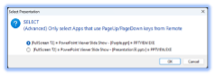
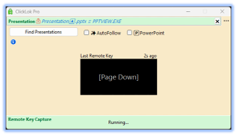
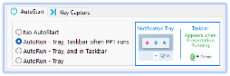
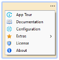

# ClickLok Pro (Non-Stop Presentations)

This is the Pro Version of the application – It is optimized for professionals who present more frequently or are in a setting where the presentation computer may also, be the machine used for streaming or other AV activities. 

The App is designed to make sure when you advance the presentation using a remote each time the button is clicked, that click goes to the presentation. 

## Overview

ClickLok performs a very complex job, but we have worked hard to make using it fast and simple. 
Making it work seamlessly for users is our goal.

- For most users - there is just one button to click
- If you want to manually select the Presentation then you need to choose which presentation

> **NOTE:** For a great majority, <b>Simple Operations</b> is all you actually need to read!
>
> The program has lots of depth and you can do a lot with it. However, for most it just works out of the box not changes needed. 
> We know that some love the details of all features, for you we have added a full manual. 

## Starting and Running

| From Start Menu | From Desktop |
|------------------------|------------------------|
|  |  |

### Simple Operations

> <b>Find Presentation</b>
> - AutoFollow (Start presentation in Fullscreen mode and click ‘Find presentations’)
> - Manual Select (Start presentation, Uncheck PowerPoint and click ‘Find Presentations’)

> <b>Control Presentation</b>
> - Once ClickLok is running, use **Remote** &nbsp;&nbsp;&nbsp;  or, **Page up/down** keys to control the Presentation 

> <b>Running with Single or Dual Monitors</b>
> 
> | Single Monitor | Dual Monitor |
> |------------------------|------------------------|
> |  |  |
> 
> _You can use Alt + Tab to switch between Applications for both situations_

### Restore App to screen where Taskbar Icon is Clicked

One of the PowerPoint features allows you to change which monitor to run your presentation on. ClickLok takes that into account by allowing you to restore the application to whichever monitor you want instead of the monitor where it was minimized.

1) Monitor 1 - Presentation is running here Minimize ClickLok
2) Monitor 2 - Click on Right Taskbar Icon to restore ClickLok   

 

1) Monitor 2 - Presentation is running here Minimize ClickLok
2) Monitor 1 - Click on Left Taskbar Icon to restore ClickLok

 

### Auto Modes (AutoFollow, AutoSelect) 

Both modes automatically choose your displayed Fullscreen Presentations.
(Changed via the settings menu)

- Each time slide changes, selects Active Presentation
- Selects the Active Presentation when Find Presentations clicked

Steps
- Start Fullscreen Presentations as normal
- Start ClickLok
- Click **Find Presentations**
- Use **Remote** or alternatively, **Page up/down** keys to navigate the presentation

(_Optional_) Click ℹ️ Button (to view selected presentation info & test navigation)

At this point you may wish to minimize or move ClickLok to a second monitor

 

1. Run & Click **Find Presentations**

 
 

2. Control presentation using **Remote** &nbsp;&nbsp;&nbsp;  or keyboard (**Page up/down**)

### Manual Mode 

This Function allows manual selection of Presentations or other Applications. 
(Allowing running presentations that are not Fullscreen or even apps other than PowerPoint)

Steps
- Start Fullscreen Presentations as normal
- Start ClickLok
- Uncheck **AutoFollow/AutoSelect** & **PowerPoint**
- Click **Find Presentations**
- Choose Presentation from list

- Use **Remote** &nbsp;&nbsp;&nbsp;  or alternatively, **Page up/down** keys to navigate the presentation

(_Optional_) Click ℹ️ Button (to view selected presentation info & test navigation)

At this point you may wish to minimize or move ClickLok to a second monitor

 

1. Run & Uncheck **AutoFollow/AutoSelect** & **PowerPoint**

2. Click **Find Presentations** & Select Presentation

   

3. Control your presentation using **Remote** &nbsp;&nbsp;&nbsp;  or keyboard (**Page up/down**)

### AutoRun Mode 

This sets ClickLok Pro to start on windows boot and run in the background. When a PowerPoint Presentation is started, it is automatically detected and protected from interruptions.

Steps
- Go to **Configuration** via the menu
- Select one of the AutoRun settings (_#1 suggested_)
- **Save** Changes

- Use **Remote** or alternatively, **Page up/down** keys to navigate the presentation

(_Optional_) View ClickLok Pro running in the Notification Tray

 

1. Open Configuration

2. Select AutoRun Mode (_#1 suggested_)

3. On Settings change, Notification reminds you ClickLok Pro is running in the Notification Tray

4. Now whenever you run a Fullscreen PowerPoint Presentation, ClickLok Pro just works in the background When you restart windows, it runs automatically in the background to protect your presentations!

5.	(_Optional_) Access the ClickLok Pro features from the Notification Tray menu

## Program Features

### In App Features

- App Floats over other windows so cannot get lost, but can still be minimized
- Unicode & Emoji Support
- Remote Keystroke History

- Various Running Modes (_AutoRun, AutoFollow, AutoSelect, Manual_)

- Extensive Help hints and built in Documentation

- Menu options – App Tour, Documentation, Configuration, Extras (_Demo, Tutorials, Support_)

- Configuration (_Live preview of settings changes_)

- Notifications for ended presentations

 

### Taskbar Features

The taskbar gives extra functionalities and displays extra information while the presentation is running. 

- Running state.  (shows when presentation has been selected)

Stopped
Running

| Stopped | Running |
|------------------------|------------------------|
|  |  |

- Keypress Notifications. (Visually shows presentation direction and timing of Remote keystrokes)

Rotates as slideshow progresses

Navigation info is shown in Taskbar for Presentation

  

- Minimize / Restore (Application restores to the monitor where taskbar icon is clicked)

 

### Notification Tray Features

When in **AutoRun** mode ClickLok Pro runs in the background and offers hands free operation to keep your presentations on track without needing to do anything manually.

In Settings choose one of the AutoRun Selections, save, and everything just runs

- Start presenting a Fullscreen presentation and ClickLok Pro just handles everything

#### These are the 3 Options for AutoRun

1. View in Notification Tray, on Taskbar when PowerPoint Presenting

2. View in Notification Tray, and always show on taskbar 

(Some may find this cluttering as it is showing even when not using PowerPoint)

3. View in Notification Tray Only 

?> #1 or #3 are recommended modes. They stay out of the way, while keeping your presentations running smoothly.

#### Accessing ClickLok while in AutoRun mode

1. Click on the Notification Tray
2. Click on the ClickLok Pro Icon 

(_Icon could be Pink, Green, or White and Pink depending on its sleep, awake, running cycle_)

**Or** you can go into Configuration and set ‘No AutoStart’ to make the App appear on the desktop

 

### Icon Definitions

The icons in the Notification Tray are usually hidden, but they help visually show what is going on while ClickLok is Running in                      mode.

**WAIT** – (_System Waiting for PowerPoint to start_)
    
 ( <- -> ) 

**POLL** – (_Waiting for Fullscreen PowerPoint Presentation to Start_)

 ( -> )  ( -> )    

**STILL** – (_Occasionally system checks to make sure PowerPoint is still running_)

 

Icon Flow for **AutoRun** detecting a Fullscreen PowerPoint presentation
                                                                           

| Presentation Selected | &nbsp;&nbsp;&nbsp;&nbsp;&nbsp; Presentation is Running | &nbsp;&nbsp;&nbsp;&nbsp;&nbsp; If Presentation Available, App Loops |
|--|--|--|
|  &nbsp;&nbsp;  | &nbsp;&nbsp;&nbsp;  | &nbsp;&nbsp;&nbsp;  &nbsp;&nbsp;  |
| | &nbsp;&nbsp;&nbsp;&nbsp;&nbsp;  | &nbsp;&nbsp;&nbsp;&nbsp;&nbsp;  |

  

## Menu

Access extra functions and settings via the App menu

- **App Tour** - (_Visual tour of main App functions_)
- **Documentation** - (_Full Visual Manual_)
- **Configuration** - (_Adjust optional settings_)
- **Extras**
  - Demo
  - 1 Monitor .pptx Tutorial
  - 2 Monitor .pptx Tutorial
  - Web Support
- **License** - (_Register and view License_)
- **About** - (_Version and Build Info_)

 

## Extras Menu

<!-- ### Demo
 -->
 
<table>
  <tr>
    <td></td>
    <td><h3>Demo</h3></td>
  </tr>
</table>

The Demo quickly goes over issues that can happen during a presentation and how ClickLok can resolve them, It then proceeds to the App Tour.

 
<table>
  <tr>
    <td></td>
    <td><h3> 1 Monitor .pptx Tutorial</h3></td>
  </tr>
</table>

The best way to understand a product is to use its features. This .pptx presentation Tutorial takes the user through the features in simple steps. Allowing users to be able to evaluate which functionalities best match their presentation style.

 
<table>
  <tr>
    <td></td>
    <td><h3> 2 Monitor .pptx Tutorial</h3></td>
  </tr>
</table>

This Tutorial takes you through the features above as well as going through extra dual monitor functionalities.

 
<table>
  <tr>
    <td></td>
    <td><h3> Web Support </h3></td>
  </tr>
</table>

- Need some extra help?
- Want to give feedback?
- Just want to read about upcoming or the latest release? 

This is the link for you! 

 

## Configuration

The Pro Version of the application allows several advanced features to make your life easier.
We provide defaults, but know everyone works differently, so have several options if you so desire.

Some of the extras you 
can configure are:
 
- Find Modes 
- Themes
- Taskbar Info
- AutoStart
- Key Capture

### Find Modes

Display Different Auto Find Modes
- **AutoFollow** – Each time slide changes, it selects Active Presentation
- **AutoSelect** – Selects the Active Presentation when Find Presentations clicked

### Themes

- Light
- Colorful
- DarkPaper

### Taskbar Info

Configure what type of information is being displayed on the taskbar while presentation running

### AutoStart

- No Auto Start

- View in Notification Tray, on Taskbar when PowerPoint Presenting

- View in Notification Tray, and always show on taskbar (_It always shows even when not using PowerPoint_)

- View in Notification Tray Only

_(#1 or #3 are recommended. They stay out of the way, while keeping your presentations running smoothly)_

### Key Capture
(Advanced Setting)

**This is an advanced setting** that very few people will want to modify.

The setting allows you to stop receiving key input from a **Remote** control. 

Almost all presentation remotes do not require drivers to be installed. 
This feature works because they register as a keyboard and send **PageUp** and **PageDown** Keystrokes to control presentations. 
For ClickLok to do its magic, it captures these keystrokes. 

!> NOTE: Stopping Remote Key Capture, pauses ClickLok.

If you have someone running your presentation computer, and multi-tasking between programs, <u>there is an extremely small chance,</u> the other program required the PageUp and PageDown keys to work. 

 

**HOWEVER, if this is the case for you, here is how you use this feature**
1) In Config, Set the Start/Stop Button to be Shown
2) While presenting, from the ClickLok Pro window Click on the Stop Button
3) Preform the Action in the other program using the **PageUp** & **PageDown** Buttons
4) From ClickLok Pro Click the Start button to un-pause ClickLok

?> Remember while ClickLok paused, it cannot protect your presentation from interruptions. 

 

## Controlling other Software

The pro version of ClickLok allows
- Sending keystrokes to any application you would like, which allows you to control presentations using various applications like **LibreOffice**, **OpenOffice**, **OnlyOffice** etc.
- Allows control of non Fullscreen PowerPoint Presentations.

In fact - ClickLok Pro can control any application that accepts **PageUp** & **PageDown** key control. 

### The Process

From the Main ClickLok Pro screen 
1. Un-check the PowerPoint filter

2. Click on the **Find Presentations** Button
3. From the Dialog select the window that you wish to Control

4. Click on the ℹ️ button the **&lt; Page Up** and **Page Down &gt;** buttons to test if the application accepts Keystrokes control.

5. <u>If control works</u> ***Close*** _the Selected Presentation Info window and run presentation as normal._ <u>If control does not work</u>, _use **Find Presentations** again and select a different window._

 

### Hints

Because each Software Application works slightly differently, you need to manually select the correct window to control. 

The Manual process is flexible it provides control even when those programs are updated. 

**Examples controlling some Alternative Presentation Programs**

> **NOTE:** 
>  
> Depending on the Version of the Application you may need to select one of the following 
> (some presentation software allows you to control several types of windows)
> - Windowed Presentation 
> - Fullscreen Presentation Window 
 >- Presenter Window

**LibreOffice (v24)**
The Current Version of LibreOffice (.pptx .ppt .odp)
1) Start the Presentation in Fullscreen mode
2) Select the presentation window using the Selection Dialog
   - Only Choose (a) or (b) and then (c)
   - a) Select Fullscreen presentation **[&lt;PresenatationName> - LibreOffice ≡ Impress SOFFICE.BIN]**
   - b) Select Presenter mode window **[Presenting: &lt;PresenatationName>]**
   - c) Use **Remote** or alternatively, **Page up/down** keys to navigate the presentation

 

**OnlyOffice (v8)**
The Current Version of OnlyOffice (.pptx .ppt .odp)
1) Start the presentation as “Show Presenter View”
2) Select the presentation window using the Selection Dialog
   - a) Select Presenter mode window **[ONLYOFFICE Desktop Editors ≡ EDITORS.EXE ]**
3) Use **Remote** or alternatively, **Page up/down** keys to navigate the presentation

 

## FAQs

### I only have a single monitor, is ClickLok Pro still useful for me

> Yes, ClickLok's primary function is to make sure each time you press the remote, the presentation advances, even if something something on the computer made the presentation go into the background. This still works fine if you only have a single Monitor. 

> If you want to be able to see ClickLok info, while running with a single screen you have two options. (1) If using a projector, Make the Projector the second screen and display the presentation on the projector only. (2) Although usually used for diagnosing issues, ClickLok will float above your presentation if not minimized

### I like the program, but am too busy to set it up each time I go to present

> AutoRun is just what you want, go to Configuration in the Menu and then turn on AutoRun

### Doesn't AutoStart slowdown my computer while it is running in the background?

> AutoRun has been designed with this and powersaving in mind. It sleeps and only wakes up after you start up PowerPoint. When your presentation is over, it goes back to sleep

### Why does ClickLok Not look like some of the pictues I see?

> You need to select a different Theme. Go into configuration and select a different Theme

### Is there a way where when presenting, to switch Presentations, without stopping and reselecting the presentation with ClickLok Pro?

> Yes, If you have ClickLok Pro in **AutoFollow** Mode, simply make the presentation you want to be controlled full screen. The next time the remote is pushed this presentation will be controlled

### I want to make sure my presentation cannot be switched while I am presenting

> Sure, Simply make sure ClickLok Pro is in **AutoSelect** or **ManuallySelected** mode. You will see the lock icon beside the presentation name

### I want to go from AutoFollow, to AutoSelect to lock my presentation, but I don't want to stop the presentation

> Sure, Simply go to Configuration, and change it andSave you change. Presenttation will continue as you make the change

### I want to sort some slides in another presentation, while the presentation is going on

> Sure, Simply Configure/Check that the current presentation is in **AutoSelect** or **ManuallySelected** lock mode first

### Did the Presentation End, or Crash on its own?

> Simply look at the ClickLok Application, if a Presentation Crashes, or Ends a Banner informs you of this on the App

