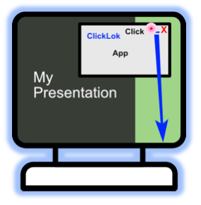
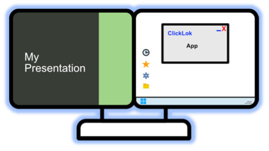
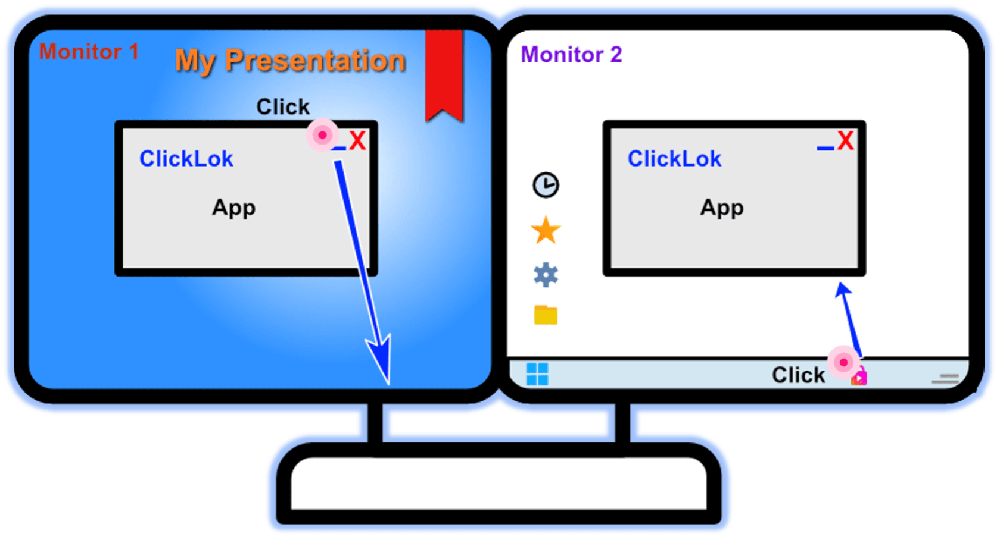
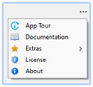

  <a href="https://clickLok.com"></img></a>
  ClickLok Standard

# ClickLok Standard (Non-Stop Presentations)

This is the Standard Version of the application – It is optimized for those who present and need to make sure nothing interrupts their presentation. Whether it’s a notification, a new app or even someone using the machine while the presentation is running ClickLok has you covered.

The App is designed to make sure when you advance the presentation using a remote each time the button is clicked, that click goes to the presentation. 

<table style="border-collapse: collapse; width: 100%;">
    <tr>
        <th style="background-color: lightlightgrey; padding: 10px; text-align: left;"><strong><a href="#/README">General Info</a></strong></th>
        <th style="background-color: white; padding: 10px; text-align: left;"> </th>
        <th style="background-color: lightlightgrey; padding: 10px; text-align: left;"><strong><a href="#/PRO">ClickLok Pro Info</a></strong></th>
                <th style="background-color: white; padding: 10px; text-align: left;"> </th>
        <th style="background-color: lightlightgrey; padding: 10px; text-align: left;"><strong><a href="#/STANDARD">ClickLok Standard Info</a></strong></th>
    </tr>
</table>

## Overview

ClickLok performs a very complex job, but we have worked hard to make using it fast and simple. 
Making it work seamlessly for users is our goal.

- For most users - there is just one button to click
- If you want to manually select the Presentation then you need to choose which presentation

> **NOTE:** For a great majority, <b>Simple Operations</b> is all you actually need to read!
>
> The program has lots of depth and you can do a lot with it. However, for most it just works out of the box not changes needed. 
> We know that some love the details of all features, for you we have added a full manual. 

## Starting and Running

| From Start Menu | From Desktop |
|------------------------|------------------------|
|  |  |

### Simple Operations

> <b>Find Presentation</b>
> - AutoFollow (Start presentation in Fullscreen mode and click ‘Find presentations’)
> - Manual Select (Start presentation, Uncheck PowerPoint and click ‘Find Presentations’)

> <b>Control Presentation</b>
> - Once ClickLok is running, use **Remote** &nbsp;&nbsp;&nbsp;  or, **Page up/down** keys to control the Presentation 

> <b>Running with Single or Dual Monitors</b>
> 
> | Single Monitor | Dual Monitor |
> |------------------------|------------------------|
> |  |  |
> 
> _You can use Alt + Tab to switch between Applications for both situations_

### Restore App to screen where Taskbar Icon is Clicked

One of the PowerPoint features allows you to change which monitor to run your presentation on. ClickLok takes that into account by allowing you to restore the application to whichever monitor you want instead of the monitor where it was minimized.

1) Monitor 1 - Presentation is running here Minimize ClickLok
2) Monitor 2 - Click on Right Taskbar Icon to restore ClickLok   

 

1) Monitor 2 - Presentation is running here Minimize ClickLok
2) Monitor 1 - Click on Left Taskbar Icon to restore ClickLok

 

### Auto Mode (AutoSelect) 

Automatically choose your displayed Fullscreen Presentations.

– Selects the Active Presentation when Find Presentations clicked

Steps
- Start Fullscreen Presentations as normal
- Start ClickLok
- Click Find Fullscreen Presentations
- Use Remote or alternatively, Page up/down keys to navigate the presentation

(Optional) Click ℹ️ Button (to view selected presentation info & test navigation)

At this point you may wish to minimize or move ClickLok to a second monitor

1. Run & Click Find Fullscreen Presentations 

 
 

2. Control presentation using **Remote** &nbsp;&nbsp;&nbsp;  or keyboard (**Page up/down**)

### Manual Mode 

This Function allows manual selection of Presentations. 

Steps
- Start Fullscreen Presentations as normal
- Start ClickLok
- Uncheck the **AutoSelect**
- Click **Find Fullscreen Presentations**
- Choose Presentation from list

- Use **Remote** &nbsp;&nbsp;&nbsp;  or alternatively, **Page up/down** keys to navigate the presentation

(_Optional_) Click ℹ️ Button (to view selected presentation info & test navigation)

At this point you may wish to minimize or move ClickLok to a second monitor

 

1. Run & Uncheck AutoSelect

 

2. Click Find Fullscreen Presentations & Select Presentation

   

3. Control your presentation using **Remote** &nbsp;&nbsp;&nbsp;  or keyboard (**Page up/down**)

## Program Features

### In App Features

- App Floats over other windows so cannot get lost, but can still be minimized
- Unicode & Emoji Support
- Remote Keystroke History

- Various Running Modes (AutoSelect, Manual)

- Extensive Help hints and built in Documentation

- Menu options – App Tour, Documentation, Configuration, Extras (Demo, Tutorials, Support)

- Notifications for ended presentations

 

### Taskbar Features

The taskbar gives extra functionalities and displays extra information while the presentation is running. 

- Running state.  (shows when presentation has been selected)

Stopped
Running

| Stopped | Running |
|------------------------|------------------------|
|  |  |

- Keypress Notifications. (Visually shows presentation direction and timing of Remote keystrokes)

Rotates as slideshow progresses

Navigation info is shown in Taskbar for Presentation

  

- Minimize / Restore (Application restores to the monitor where taskbar icon is clicked)

 

## Menu

Access extra functions and settings via the App menu

- **App Tour** - (_Visual tour of main App functions_)
- **Documentation** - (_Full Visual Manual_)
- **Extras**
  - Demo
  - 1 Monitor .pptx Tutorial
  - 2 Monitor .pptx Tutorial
  - Web Support
- **License** - (_Register and view License_)
- **About** - (_Version and Build Info_)

 

## Extras Menu

### Demo

The Demo quickly goes over issues that can happen during a presentation and how ClickLok can resolve them, It then proceeds to the App Tour.

### 1 Monitor .pptx Tutorial

The best way to understand a product is to use its features. This .pptx presentation Tutorial takes the user through the features in simple steps. Allowing users to be able to evaluate which functionalities best match their presentation style.

### 2 Monitor .pptx Tutorial

This Tutorial takes you through the features above as well as going through extra dual monitor functionalities.

### Web Support

- Need some extra help?
- Want to give feedback?
- Just want to read about upcoming or the latest release? 

This is the link for you! 

 

## FAQs

### I only have a single monitor, is ClickLok still useful for me

> Yes, ClickLok's primary function is to make sure each time you press the remote, the presentation advances, even if something something on the computer made the presentation go into the background. This still works fine if you only have a single Monitor. 

> If you want to be able to see ClickLok info, while running with a single screen you have two options. (1) If using a projector, Make the Projector the second screen and display the presentation on the projector only. (2) Although usually used for diagnosing issues, ClickLok will float above your presentation if not minimized

### Did the Presentation End, or Crash on its own?

> Simply look at the ClickLok Application, if a Presentation Crashes, or Ends a Banner informs you of this on the App

### I like the program, but am too busy to set it up each time I go to present

> This is a Feature of ClickLok Pro. Yhy don't you upgrade today, you will get this plus multiple other features

### Is there a way where when presenting, to switch Presentations, without stopping and reselecting the presentation with ClickLok Pro?

> This is a Feature of ClickLok Pro. Yhy don't you upgrade today, you will get this plus multiple other features

### Why does ClickLok Not look like some of the pictues I see?

> Themes is a feature of ClickLok Pro. Yhy don't you upgrade today, you will get this plus multiple other features 

